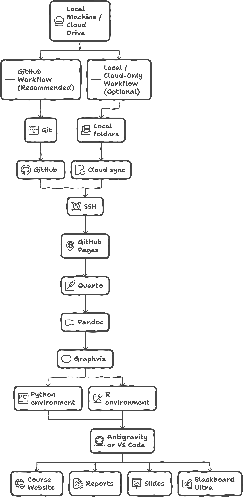
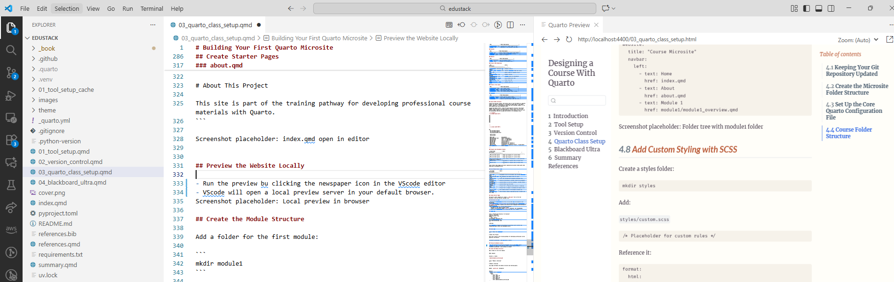

# Building Your First Quarto Microsite

This chapter walks you through creating and organizing a Quarto microsite. Before beginning, review the to-do list below. You can click on each item to jump to its section.

{width="80%" fig-align="center" #fig-quicksetupflow}


## Keeping Your Git Repository Updated

If you are using GitHub or any Git-based workflow, run a pull before starting work and a push after you finish a working session. This prevents merge conflicts, overwriting, or accidental loss of changes when building large course sites.

Pull before you begin each session:

```
git pull
```

Stage and commit your updates during work:

```
git add .
git commit -m "Update microsite structure"
```

Push your changes when you are done:

```
git push
```

You may repeat these commands several times as you work through this chapter so that your repository accurately reflects your progress and remains synchronized across devices or collaborators.


## Create the Microsite Folder Structure

The cleanest workflow is to create the GitHub repository first, clone it locally,
and then add the Quarto structure inside that cloned repository. This avoids the
common problem of building a local course folder and later trying to connect it
to GitHub after files already exist.

1. Create a new GitHub repository for the course.
2. Add a `README.md` and a Python `.gitignore`.
3. Clone the repository locally:

   ```bash
   git clone https://github.com/your-org/my-course.git
   cd my-course
   ```

4. Pull before adding files:

   ```bash
   git pull
   ```

5. Initialize Quarto inside the cloned repository:

   ```bash
   quarto create project website .
   ```

6. Commit and push the starter site:

   ```bash
   git add .
   git commit -m "Initialize Quarto course site"
   git push
   ```

You may still work entirely on a local drive or cloud-synced folder, but the GitHub-first workflow is preferred for course development because it gives you backup, history, collaboration, and a cleaner path to GitHub Classroom.

## Set Up the Core Quarto Configuration File

The `_quarto.yml` file defines the structure and appearance of your microsite. A minimal starter configuration looks like this:

```
project:
  type: website
  preview:
    port: 4300
    browser: false
  render:
    - "*.qmd"
    - "!delivarables-solutions/*"
    - "!classroom-organization/*"
    - "!data/*"
    - "Announcements/*"

editor:  
  render-on-save: true
  preview: true

execute:
  freeze: auto
  keep-ipynb: false
  fig-align: center

website:
  title: "My Course"
  navbar: false
    # search: true
    # left:
    #   - text: Syllabus
    #     href: index.qmd
    #   - text: Schedule
    #     href: schedule.qmd
    #   - text: Deliverables
    #     href: deliverables.qmd
    #   - text: "Module 1"
    #     menu:
    #       - text: "Lecture Notes 1.1"
    #         href: M01/M01_LN1.qmd
    #       - text: "Presentation 1.1"
    #         href: M01/M01_P1.qmd
    #       - text: "Lab 1"
    #         href: M01/M01_Lab1.qmd
    #       - text: "Lecture Notes 1.2"
    #         href: M01/M01_LN2.qmd
    #       - text: "Presentation 1.2"
    #         href: M01/M01_P2.qmd
    #       - text: "Lab 2"
    #         href: M01/M01_Lab2.qmd
    #       - text: "Assignment"
    #         href: M01/M01_A.qmd
    #       - text: "Project"
    #         href: M01/M01_Proj.qmd
    #   - text: "Module 2"
    #     menu:
    #       - text: "Lecture Notes 2.1"
    #         href: M02/M02_LN1.qmd
    #       - text: "Presentation 2.1"
    #         href: M02/M02_P1.qmd
    #       - text: "Lab 1"
    #         href: M02/M02_Lab1.qmd
    #       - text: "Lecture Notes 2.2"
    #         href: M02/M02_LN2.qmd
    #       - text: "Presentation 2.2"
    #         href: M02/M02_P2.qmd
    #       - text: "Lab 2"
    #         href: M02/M02_Lab2.qmd
      
format:
  html:
    bibliography: references.bib
    theme: [cosmo, ./themes/mycourse.scss]
    toc: true
    number-sections: true
    embed-resources: true
    highlight-style: github
    code-overflow: wrap
    html-math-method: mathml
    grid:
      sidebar-width: 100px
      body-width: 1100px
      margin-width: 400px
      gutter-width: 1.5rem

crossref:
  fig-title: '**Figure**'
  fig-labels: arabic
  title-delim: "**.**"
```

### Project

| Key                                 | Short Description                             |
| ----------------------------------- | --------------------------------------------- |
| type: website                       | Treats the project as a multi-page website.   |
| preview.port: 4300                  | Runs the local preview server on port 4300.   |
| preview.browser: false              | Prevents automatic browser launch.            |
| render: "*.qmd"                     | Renders all qmd files unless excluded.        |
| render: "!deliverables-solutions/*" | Excludes instructor-only solutions.           |
| render: "!classroom-organization/*" | Excludes internal organizational files.       |
| render: "!data/*"                   | Excludes data folders from rendering.         |
| render: "Announcements/*"           | Explicitly includes the Announcements folder. |


### Editor

| Key                  | Short Description                     |
| -------------------- | ------------------------------------- |
| render-on-save: true | Automatically renders pages on save.  |
| preview: true        | Maintains a live preview as you edit. |

### Execute

| Key               | Short Description                          |
| ----------------- | ------------------------------------------ |
| freeze: auto      | Reuses cached outputs unless code changes. |
| keep-ipynb: false | Prevents generating .ipynb versions.       |
| fig-align: center | Centers all figures.                       |

### Website

| Key                | Short Description            |
| ------------------ | ---------------------------- |
| title: "My Course" | Sets the website title.      |
| navbar: false      | Disables the navigation bar. |

### Format (HTML Rendering)

| Key                           | Short Description                            |
| ----------------------------- | -------------------------------------------- |
| bibliography: references.bib  | Enables citation support.                    |
| theme: [cosmo, mycourse.scss] | Applies Bootswatch theme and custom SCSS.    |
| toc: true                     | Adds a table of contents to all pages.       |
| number-sections: true         | Numbers section headings.                    |
| embed-resources: true         | Inlines assets for Blackboard compatibility. |
| highlight-style: github       | Uses GitHub-style code highlighting.         |
| code-overflow: wrap           | Wraps long code lines.                       |
| html-math-method: mathml      | Renders math via MathML.                     |

### Format → Grid Layout

| Key                  | Short Description                    |
| -------------------- | ------------------------------------ |
| sidebar-width: 100px | Sets sidebar width.                  |
| body-width: 1100px   | Sets main body width.                |
| margin-width: 400px  | Sets margin column width.            |
| gutter-width: 1.5rem | Sets spacing between layout columns. |

### Crossref

| Key                 | Short Description                         |
| ------------------- | ----------------------------------------- |
| fig-title: "Figure" | Prefix used for figure labels.            |
| fig-labels: arabic  | Uses Arabic numerals for figures.         |
| title-delim: "."    | Inserts a period between label and title. |


## Course Folder Structure

Create the top-level folders. BU Virtual likes to see the modules as separate folders for better organization. Use a two-digit module number, such as `M01`, `M02`, and `M03`, so the folders sort cleanly. Module 0 can be represented as `M00` if you need a prerequisite or orientation module.

Inside each module folder, create the same baseline structure. Each module should follow the same `M01_*` pattern. Please create files with the specific names regardless of whether they are used immediately. The files are placeholders and can be empty or hidden at the Blackboard level.

:::{.callout-tip}
You can create this structure manually once to understand it, or generate it automatically with `scripts/generate_modules.py` in Chapter 8. The automated path is recommended once you know the naming convention.
:::

```{mermaid}
flowchart TD

%% Group: Module Structure
subgraph ModuleStructure["**Module Structure**"]
        direction TB
        B1[M01_lecture01_figures]
        B2[M01_lecture02_figures]
        B3[M01_presentation01_files]
        B4[M01_presentation02_files]
    end

%% Coloring
classDef lightGroup fill:#f8f3e8,stroke:#d4c7a1,color:#333
classDef lightNode fill:#fdfbf7,stroke:#d4c7a1,color:#333

class ModuleStructure lightGroup
class Subfolders lightGroup
class B1,B2,B3,B4 lightNode

```

```{mermaid}
flowchart LR

subgraph CoreFiles["**Core Authoring Files**"]
    direction LR

    %% Column 1
    subgraph Col1["***Lecture Notes and Labs***"]
        direction TB
        C1[M01_LN1.qmd]
        C2[M01_LN2.qmd]
        C3[M01_Lab1.qmd]
        C4[M01_Lab2.qmd]
    end

    %% Column 2
    subgraph Col2["***Assignments and Presentations***"]
        direction TB
        C5[M01_A.qmd]
        C6[M01_P1.qmd]
        C7[M01_P2.qmd]
    end

    %% Column 3
    subgraph Col3["***Project and Participation***"]
        direction TB
        C8[M01_Proj.qmd]
        C9[M01_Participation1.qmd]
        C10[M01_Participation2.qmd]
    end

end

%% Styling
classDef group fill:#e9f4f9,stroke:#9ac3d1,color:#1a1a1a
classDef node fill:#f7fcfe,stroke:#9ac3d1,color:#1a1a1a

class CoreFiles,Col1,Col2,Col3 group
class C1,C2,C3,C4,C5,C6,C7,C8,C9,C10 node
```

### Figures and Attachments Folders

| Folder Name                 | Short Description                                                          |
| --------------------------- | -------------------------------------------------------------------------- |
| `M01_lecture01_figures`     | Images and diagrams for Lecture Notes 1.                                   |
| `M01_lecture02_figures`     | Images and diagrams for Lecture Notes 2.                                   |
| `M01_presentation01_files`  | Assets used by Presentation 1; often generated automatically by Reveal.js. |
| `M01_presentation02_files`  | Assets used by Presentation 2; often generated automatically by Reveal.js. |
| `M01_P1_files`              | Attachments or figures used in Presentation or Project Part 1.             |
| `M01_P2_files`              | Attachments or figures used in Presentation or Project Part 2.             |

These folders keep images and assets organized and prevent broken paths when exporting to Blackboard Ultra.

### Core Module Files (.qmd)

| File Name                   | Short Description                                                   |
| --------------------------- | ------------------------------------------------------------------- |
| `M01_A.qmd`                 | Assignment file for the module; may include multi-part tasks.       |
| `M01_LN1.qmd`               | Lecture Notes for the first subtopic; includes theory and examples. |
| `M01_LN2.qmd`               | Lecture Notes for the second subtopic.                              |
| `M01_P1.qmd`                | Presentation 1 for the module.                                      |
| `M01_P2.qmd`                | Presentation 2 for the module.                                      |
| `M01_Proj.qmd`              | Full module project or project milestone.                           |
| `M01_Lab1.qmd`              | First lab introducing the applied technique from Lecture 1.         |
| `M01_Lab2.qmd`              | Second lab building on concepts toward the assignment or project.   |
| `M01_Participation1.qmd`    | First participation activity for the module.                        |
| `M01_Participation2.qmd`    | Second participation activity for the module.                       |


## Create Starter Pages

The quarto create command will create a `index.qmd` file in the root directory. This will be your syllabus file.

### References and csl

- Download the Econometrica CSL File (or any other csl file based on your discipline)
- The **Econometrica citation style** can be downloaded from: [Econometrica CSL GitHub Link](https://github.com/citation-style-language/styles/blob/master/econometrica.csl)  
- Add `econometrica.csl` to Your Quarto Project
  - Navigate to your Quarto project folder.  
  - Create a new directory named **`csl/`** (optional, but recommended).  
  - Move the **`econometrica.csl`** file into the `csl/` folder.  

### index.qmd

```
title: "AD 688 Cloud Analytics for Business" 
subtitle: "Syllabus"
number-sections: true
format:
    html: default
bibliography: references.bib
csl: csl/econometrica.csl
html-table-processing: none
---

# Welcome

This microsite introduces the workflow for building course content and integrating Quarto HTML into Blackboard Ultra.
```

### about.qmd

```
title: "About This Microsite"
---

# About This Project

This site is part of the training pathway for developing professional course materials with Quarto.
```

Screenshot placeholder: index.qmd open in editor


## Preview the Website Locally

- Run the preview bu clicking the newspaper icon in the VScode editor
- VScode will open a local preview server in your default browser.

{width="80%" fig-align="center" #fig-vsc-quarto-preview}

## Create the Module Structure

- Add a folder for the first module: `M01`.
- Inside it, create the canonical module files, including `M01/M01_LN1.qmd`, `M01/M01_P1.qmd`, `M01/M01_Lab1.qmd`, and `M01/M01_A.qmd`.
- Start with the lecture notes file. Add content to `M01/M01_LN1.qmd` using this example from AD 688 Cloud Analytics for Business:


```
---
title: "Module 1: Highlights"
subtitle: "Cloud Foundations and Big Data Pipelines"
number-sections: true
date: "2024-11-21"
date-modified: today
date-format: long
categories: ["Cloud Computing", "Big Data", "AWS Academy", "APIs", "Data Engineering", "Cloud Storage"]
---


# Lecture 01: Introduction to Big Data and Cloud

## Highlights

* Understand the landscape of **Big Data**: volume, velocity, variety, veracity, and value.
* Overview of course logistics, expectations, and deliverables.
* Familiarization with key **terminology** in cloud and data engineering.
* Setup instructions for development environments, including VS Code and browser-native notebooks.
* Introduction to **AWS Academy Learner Labs** and access setup.

## Learning Objectives

By the end of this lecture, students will be able to:

* Explain the characteristics and challenges of working with big data.
* Set up their local and cloud-based development environments.
* Navigate the AWS Academy interface and launch cloud instances.
* Describe the roles of data engineers, cloud architects, and analysts in cloud ecosystems.


# Lecture 02: Data Pipelines with APIs and Cloud Services

## Highlights

* Introduction to **cloud-native data architecture** and the flow of data in modern systems.
* Understand **data pipelines** and their components: ingestion, transformation, storage, and access.
* Compare and contrast storage and data management options:

  * AWS S3 (object storage)
  * Azure Blob Storage
  * Google BigQuery (serverless, warehouse)
* Introduction to using **APIs for data ingestion** and service orchestration.

## Learning Objectives

By the end of this lecture, students will be able to:

* Explain the structure and function of data pipelines.
* Identify key differences between cloud storage solutions across major providers.
* Describe how APIs integrate with cloud services for real-time and batch processing.
* Connect cloud theory with practical workflow design in analytics projects.

```

## Add Custom Styling with SCSS

- Create a `theme/styles` folder:
- Add `scss/mycourse.scss`
- Sample scss is available [AD688-Web-Analytics/themes](https://github.com/BostonAnalytics/AD688-Web-Analytics/blob/main/analytics_themes/web-analytics.scss).
- Make sure this theme is referenced in the `_quarto.yml` file under `theme`.

## Optional Git Workflow Throughout the Chapter

You may run these commands after each major step.

Pull updates before continuing:

```
git pull
```

Save your work:

```
git add .
git commit -m "Progress on microsite"
```

Push updates:

```
git push
```

This ensures your repository captures every structural change without waiting until the end.


## Preparing for Blackboard Ultra Integration

Blackboard Ultra does not host Quarto sites directly. In upcoming chapters, you will export rendered HTML files and map them to the Blackboard course structure. For now, ensure that:

- File paths are clean
- Navigation is easy to follow
- Pages render correctly without external dependencies
- The microsite structure mirrors the eventual Blackboard module layout

## Final Checklist

Your microsite is ready for content development if you have:

- A working folder structure    
- index.qmd and about.qmd rendering without error
- Module folders initialized
- A functional `_quarto.yml`
- Local preview running
- Basic SCSS scaffolding
- Optional Git workflow active and consistent
