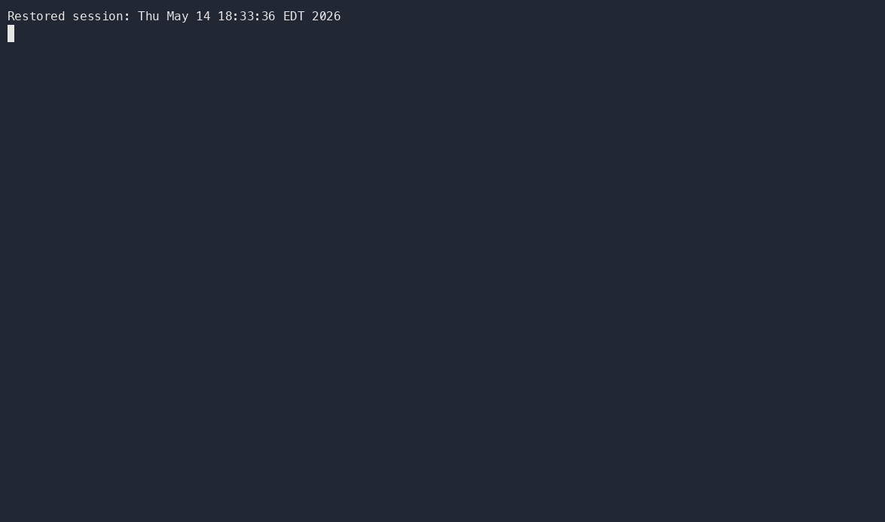
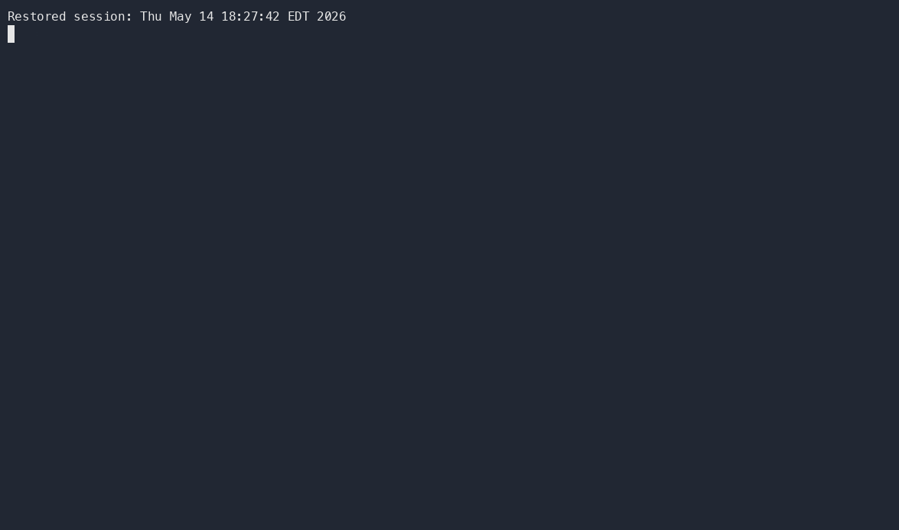

# Administering Coursework with Classroom 50

GitHub Classroom has historically been the easiest way to distribute coding
assignments from a template repository, collect student work, and support
autograding. Because the legacy GitHub Classroom service is expected to stop
being a reliable path after August 2026, this workflow now uses
**Classroom 50** as the assignment-management layer.

Classroom 50 keeps the parts that work well for technical courses: GitHub
repositories, starter templates, GitHub Actions autograding, roster-based
collection, and downloadable submissions. The main difference is operational:
teachers manage the classroom through the GitHub CLI instead of a hosted
Classroom dashboard.

The command sequence in this chapter follows the upstream
[Classroom 50 CLI Teacher Guide](https://github.com/foundation50/classroom50/wiki/CLI-Teacher-Guide).
Keep the upstream wiki nearby for the full command reference:
[Installation](https://github.com/foundation50/classroom50/wiki/Installation),
[CLI Student Guide](https://github.com/foundation50/classroom50/wiki/CLI-Student-Guide),
[Assignment Templates](https://github.com/foundation50/classroom50/wiki/Assignment-Templates),
[Autograders](https://github.com/foundation50/classroom50/wiki/Autograders),
[GitHub Integration](https://github.com/foundation50/classroom50/wiki/GitHub-Integration),
[`gh teacher` command reference](https://github.com/foundation50/classroom50/wiki/gh-teacher),
[`gh student` command reference](https://github.com/foundation50/classroom50/wiki/gh-student),
and [Troubleshooting](https://github.com/foundation50/classroom50/wiki/Troubleshooting).

## Why Classroom 50 Fits This Workflow

The Quarto workflow established earlier generates predictable module folders
such as `M01`, `M02`, and `M03`, each with files like `M01_A.qmd`,
`M01_Proj.qmd`, and `M01_Lab1.qmd`. Those folders can become starter material
for individual or group repositories.

Classroom 50 adds four pieces around that Quarto source:

- a private `<org>/classroom50` configuration repository
- one directory per classroom, with `classroom.json`, `assignments.json`,
  `students.csv`, and `scores.json`
- GitHub teams and org settings that keep student repositories private and
  limited
- teacher and student CLI commands for accepting, submitting, collecting, and
  downloading work

In practice, Blackboard Ultra remains the student-facing course shell, Quarto
remains the source of truth for instructional material, GitHub remains the code
workspace, and Classroom 50 manages the assignment repositories.

## Install the CLI Extensions

Classroom 50 is delivered as two GitHub CLI extensions: `gh teacher` for
instructors and `gh student` for students.

Install both extensions:

```bash
gh extension install foundation50/gh-teacher
gh extension install foundation50/gh-student
```

Verify that the commands are available:

```bash
gh teacher --help
gh student --help
```

Update them before each semester:

```bash
gh extension upgrade gh-teacher
gh extension upgrade gh-student
```

Then authenticate with the scopes Classroom 50 needs:

```bash
gh teacher login
```


This is different from a plain `gh auth login`; the teacher command requests
the organization and workflow scopes needed for roster invitations, classroom
setup, and the config repository workflows.

## One-Time Organization Setup

Create a dedicated teaching organization on GitHub before running the CLI. The
CLI does not create the organization for you.

Recommended organization pattern:

- one GitHub organization per course, program, or teaching term
- a short, stable org name such as `ad688-fall-2026`
- private assignment repositories for students
- public or in-org private template repositories for starter code

Bootstrap the Classroom 50 config repository:

```bash
gh teacher init <org> --dry-run
gh teacher init <org>
```

The dry run is worth doing first. It checks org access, ownership, scopes, plan
constraints, and service-token readiness before the command changes the org.

During setup, Classroom 50 creates the private `<org>/classroom50` repository,
adds workflows for publishing assignment metadata and collecting scores, and
applies least-privilege organization settings. It also requires a
`CLASSROOM50_SERVICE_TOKEN` so the score-collection workflow can read student
submissions.

After setup, audit the organization:

```bash
gh teacher audit <org>
```

Some GitHub member-privilege settings still need to be confirmed in the web UI
because GitHub does not expose every setting through the REST API. Treat the
audit output as the final setup checklist.

The [GitHub Integration](https://github.com/foundation50/classroom50/wiki/GitHub-Integration)
page is the best reference for the fine-grained PAT, GitHub Pages, Actions, and
REST API details behind this setup.

## Add a Classroom

Create one Classroom 50 classroom for each course section, course shell, or
term-level teaching group.

```bash
gh teacher classroom add <org> <short-name> --name "<full name>" --term <term>
```

Example:

```bash
gh teacher classroom add ad688-fall-2026 web-analytics --name "Web Analytics" --term Fall-2026
```

The `<short-name>` becomes part of every student repository name, so keep it
short, lowercase, and stable. A repository for a student named `alice` accepting
an assignment named `module-01-lab` would use a name like:

```text
web-analytics-module-01-lab-alice
```

List classrooms when you need to confirm what has been registered:

```bash
gh teacher classroom list <org>
```

## Import the Roster

Classroom 50 stores the intended roster in
`<org>/classroom50/<classroom>/students.csv`. Manage it with the CLI rather than
editing the file by hand.

Add one student:

```bash
gh teacher roster add <org> <classroom> <username> --first-name <name> --last-name <name> --email <email> --section <section>
```

For ad-hoc organization invitations, the lower-level command is:

```bash
gh teacher invite <org> <username>
```



Bulk import a roster:

```bash
gh teacher roster import <org> <classroom> data/classroom50-roster.csv
```

Use a CSV with this header:

```csv
username,first_name,last_name,email,section
```

List the roster:

```bash
gh teacher roster list <org> <classroom>
```

Roster import also sends organization invitations to new students. Students can
accept the org invitation directly, or Classroom 50 can handle the pending
invitation when they accept their first assignment.

## Prepare Quarto Assignment Templates

For each module assignment, start from the same module structure used throughout
the course:

```text
M01/
  M01_A.qmd
  M01_Lab1.qmd
  M01_Lab2.qmd
  M01_Proj.qmd
  data/
  output/
```

Recommended template workflow:

1. Generate or update the module files with `scripts/generate_modules.py`.
2. Remove instructor-only files, solutions, keys, hidden notes, and private
   datasets.
3. Keep the student-facing `.qmd` instructions, starter code, lightweight data,
   and any required environment files.
4. Push the starter files to a dedicated GitHub repository.
5. Mark that repository as a template repository in GitHub settings.

Private templates should live inside the teaching organization. Classroom 50 can
grant the classroom team read access to in-org private templates when the
assignment is registered. Public templates can live anywhere.

For template repositories, keep the upstream
[Assignment Templates](https://github.com/foundation50/classroom50/wiki/Assignment-Templates)
contract in mind:

- `README.md` is the student-facing assignment brief.
- `.gitignore` is optional and is re-fetched by `gh student submit`.
- `.github/` is optional and is re-fetched by `gh student submit` for non-autograde workflows.
- `.github/workflows/autograde.yaml` should not live in the template; Classroom 50 writes the autograde shim when the student accepts the assignment.
- starter code can be a single file, a Quarto module folder, or a complete project skeleton.

## Add Assignments

Register each assignment in Classroom 50 with a short slug, display name,
optional template repository, and due date.

```bash
gh teacher assignment add <org> <classroom> <slug> --name "<name>" --template <owner>/<repo> --due <ISO-8601>
```

Example for an individual lab:

```bash
gh teacher assignment add ad688-fall-2026 web-analytics module-01-lab --name "Module 1 Lab" --template ad688-fall-2026/module-01-lab-template --due 2026-09-15T23:59:00-04:00
```

Template-less assignments are also allowed:

```bash
gh teacher assignment add ad688-fall-2026 web-analytics reflection-01 --name "Reflection 1"
```

For group work, register the assignment as a group assignment and include a
maximum group size:

```bash
gh teacher assignment add ad688-fall-2026 web-analytics project-01 --name "Project 1" --template ad688-fall-2026/project-01-template --mode group --max-group-size 4
```

List registered assignments:

```bash
gh teacher assignment list <org> <classroom>
```

Autograding is configured in the Classroom 50 config repository, not inside the
starter template. Use the
[Autograders](https://github.com/foundation50/classroom50/wiki/Autograders)
reference when you need a classroom default autograder, a per-assignment
`autograder.py`, declarative tests, runtime settings, allowed-file checks, or
feedback pull requests.

## Connect Assignments to Blackboard Ultra

Blackboard Ultra should point students to the assignment workflow, not replace
it.

For each Blackboard assignment item, include:

- the assignment name and due date
- the Classroom 50 classroom and assignment slug
- the template or starter repository purpose
- the required student commands
- the final LMS submission artifact, usually the GitHub repository URL or a
  short confirmation note

A simple student command block looks like this:

```bash
gh student login
gh student accept <org> <classroom> <assignment>
```




Students complete the work in the generated repository, commit normally, push,
and then submit with the Classroom 50 student command required by your
assignment instructions.

```bash
git add .
git commit -m "Complete assignment"
git push
gh student submit
```


The [CLI Student Guide](https://github.com/foundation50/classroom50/wiki/CLI-Student-Guide)
is the student-facing source to link from Blackboard when students need the full
accept, clone, group assignment, and submit workflow.

## Collect Scores and Download Work

Classroom 50 submissions publish release artifacts in each student repository.
The `<org>/classroom50` config repository includes a `collect-scores.yaml`
workflow that aggregates those release results into `scores.json`.

Trigger score collection from the shell:

```bash
gh workflow run collect-scores.yaml --repo <org>/classroom50
```

Collect for one classroom only:

```bash
gh workflow run collect-scores.yaml --repo <org>/classroom50 -f classroom=<classroom>
```

Download the latest submissions for grading, review, or archiving:

```bash
gh teacher download <org> <classroom> <assignment>
```


The download command creates a timestamped folder, clones each rostered
student's assignment repository when present, refreshes `result.json` and
`results.json`, and writes a `scores.csv` summary.

## Migration Pattern from GitHub Classroom

If you already have a legacy GitHub Classroom course, do not rebuild every
template by hand. Use the Classroom 50 migration command as the starting point:

```bash
gh teacher classroom migrate --source <id-or-org> --target <org> --dry-run
gh teacher classroom migrate --source <id-or-org> --target <org>
```

The migration path copies starter repositories into the target organization as
new templates and commits the classroom configuration. Rosters and historical
scores should be treated as separate records: export what you need from the old
system, keep an archive, and onboard students into Classroom 50 for the new
term.

## Troubleshooting References

When something fails, start with verbose output:

```bash
gh student submit -v
gh teacher download -v <org> <classroom> <assignment>
```

Use [Troubleshooting](https://github.com/foundation50/classroom50/wiki/Troubleshooting)
for the common cases: missing OAuth scopes, `workflow`-scope 404s during
`gh teacher init`, private templates that students cannot read, missing
`.classroom50.yaml`, unpublished autograder YAML, empty teacher downloads, and
`collect-scores` runs that report zero readable submissions.

## Semester Checklist

- [ ] Install or upgrade `gh-teacher` and `gh-student`
- [ ] Run `gh teacher login`
- [ ] Create or confirm the teaching organization
- [ ] Run `gh teacher init <org> --dry-run`
- [ ] Run `gh teacher init <org>`
- [ ] Complete the manual organization hardening items from `gh teacher audit`
- [ ] Add the classroom with `gh teacher classroom add`
- [ ] Import the roster with `gh teacher roster import`
- [ ] Prepare Quarto starter repositories and mark them as templates
- [ ] Register assignments with `gh teacher assignment add`
- [ ] Add Classroom 50 commands and repository expectations to Blackboard Ultra
- [ ] Test one assignment with a student-style account before publishing
- [ ] Trigger `collect-scores.yaml` after submissions begin
- [ ] Download submissions with `gh teacher download`
