# Cloud Analytics with AWS

This chapter adapts the AD688 Module 0 cloud workflow into a reusable teaching
pattern. The goal is not to turn every course into an AWS course. The goal is to
give students a predictable way to work in a remote Linux environment, keep their
work under version control, and produce reproducible Quarto deliverables.

Use this chapter when a course needs students to work with tools that are hard
to install locally, require more compute than a laptop can provide, or benefit
from a shared cloud environment.

## The cloud as the course build room

In a Quarto course, the local repository is the source of truth. The cloud
environment is the shared build room: a consistent place where students can run
the same tools, execute the same code, render the same documents, and push the
result back to GitHub.

This mirrors the larger Quarto publishing logic:

- source files stay in GitHub
- code and outputs stay connected
- the environment is documented and repeatable
- rendered materials are checked before submission or publication
- the workflow can be rebuilt by another student, instructor, or future version of the course

AWS is useful here because it gives students a common Linux machine. But the
pedagogical point is broader than AWS: do not let the environment become an
invisible, personal setup that only works once. Treat it as part of the course
publishing system.

## Why Add a Cloud Workflow?

A cloud workflow is useful when students need to:

- run Linux commands consistently across Windows, macOS, and Linux laptops
- use the same Python, Jupyter, Quarto, or Spark environment
- practice SSH and remote development
- protect course work by pushing to GitHub frequently
- learn the connection between local tools, cloud compute, and published outputs

For instructors, the cloud environment becomes a common baseline. When students
say "it works on my machine," the course has a shared machine to compare against.

## The Operating Model

The AD688-style pattern connects four pieces:

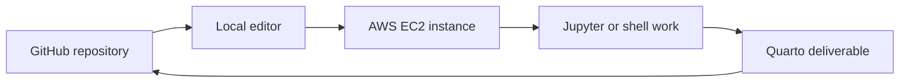

Students begin with a GitHub repository, connect to a cloud machine, do their
work in a controlled environment, render or prepare the deliverable, and push the
result back to GitHub.

{width="70%" fig-align="center"}

## Instructor Setup Checklist

Before assigning a cloud lab, confirm the pieces students will need.

- [ ] AWS Academy course or approved AWS environment is available
- [ ] Student access instructions have been distributed
- [ ] A budget or usage limit is visible to students
- [ ] Required instance type, operating system, and storage size are specified
- [ ] SSH key instructions are clear for Windows, macOS, and Linux
- [ ] Required VS Code extensions are listed
- [ ] GitHub repository naming convention is defined
- [ ] Submission format is explicit: repository URL, rendered file, screenshot, or LMS upload
- [ ] Data files and starter code are reachable from the cloud environment

For AWS Academy Learner Lab courses, students should also read the learner lab
guide and complete any required security or compliance modules before launching
resources.

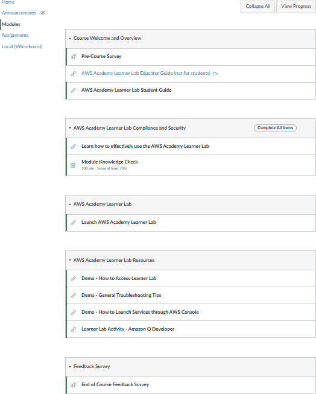{width="62%" fig-align="center"}

## Student Workflow

The student-facing sequence should stay short and repeatable.

1. Accept the AWS Academy or course cloud invitation.
2. Start the lab environment.
3. Launch an EC2 instance using the course-approved settings.
4. Download or locate the SSH private key.
5. Connect from VS Code Remote-SSH or a terminal.
6. Install or verify the required software.
7. Clone the assignment repository from GitHub.
8. Work in the repository.
9. Commit and push often.
10. Submit the required link or artifact.

This structure matters because cloud sessions can stop, instances can be
restarted, and budgets can expire. GitHub is the durable record of student work.

::: {layout-ncol=2}
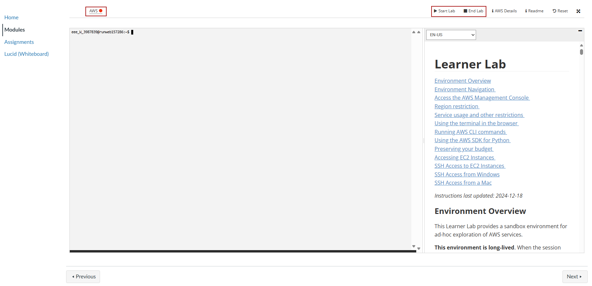

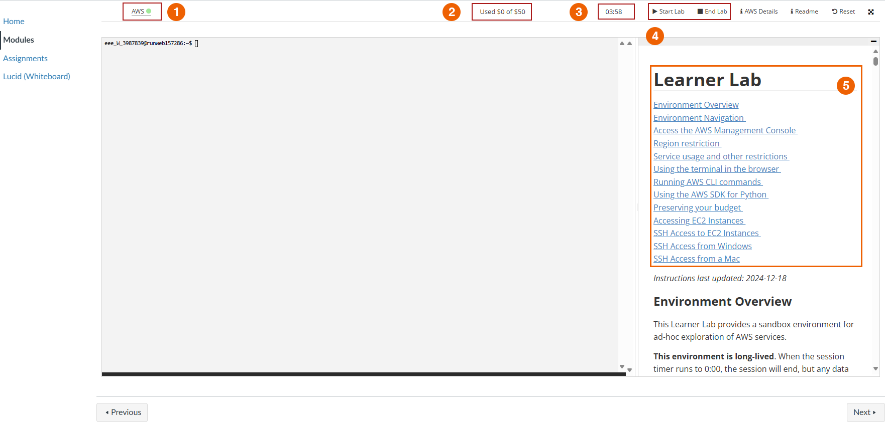
:::

## EC2 Launch Decisions

Give students exact choices instead of asking them to interpret the AWS console
from scratch.

| Decision | Course Guidance |
|---|---|
| Instance name | Use a predictable course name, such as `ad688-lab01` |
| Operating system | Use the course-approved Linux image |
| Instance type | Use the smallest approved type that supports the assignment |
| Key pair | Use the course-provided key pair or the required generated key |
| Network access | Allow only the ports required by the assignment |
| Storage | Use the course-approved size and avoid unnecessary volumes |
| Region or subnet | Keep all course resources in the same approved location |

When students are new to cloud computing, the most important lesson is not
"click every option." It is "change only the settings the course asks you to
change."

### Visual EC2 Launch Path

The AD688 lab uses a very explicit launch sequence. The screenshots below show
the path students should recognize before they work independently.

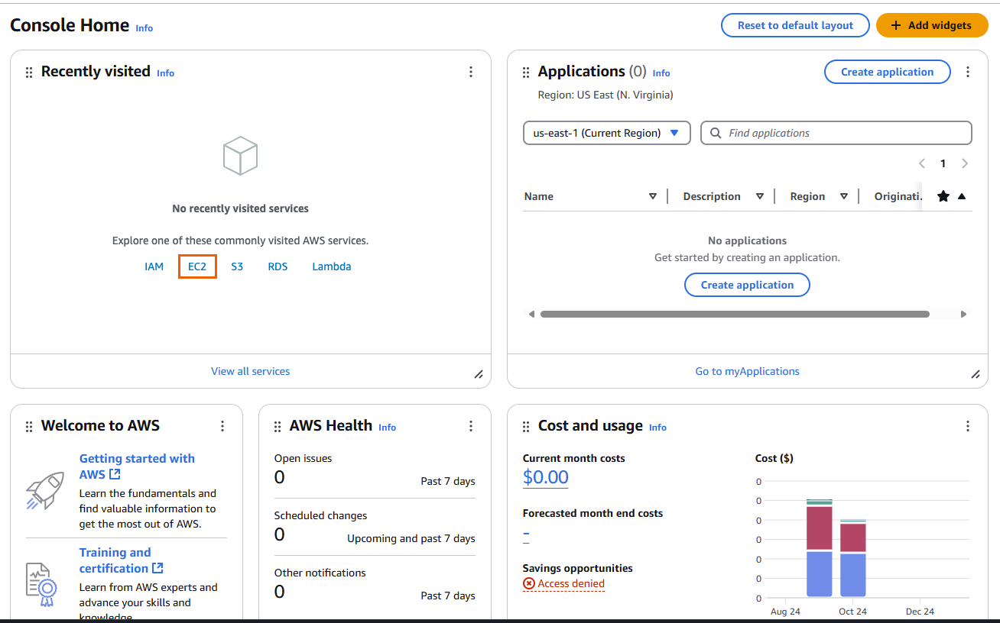{width="82%" fig-align="center"}

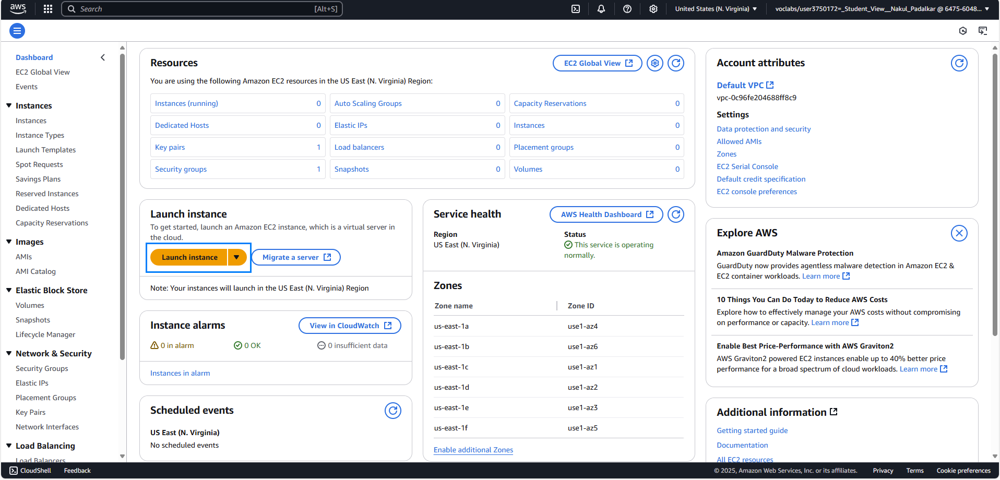{width="82%" fig-align="center"}

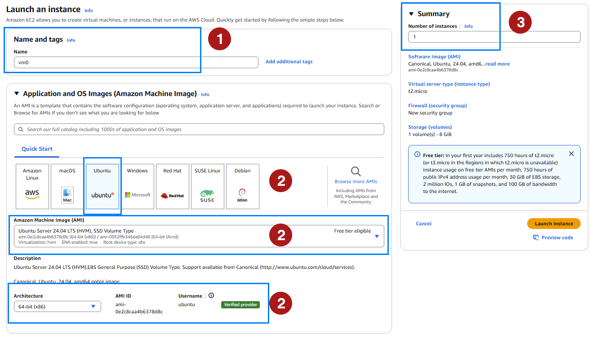{width="82%" fig-align="center"}

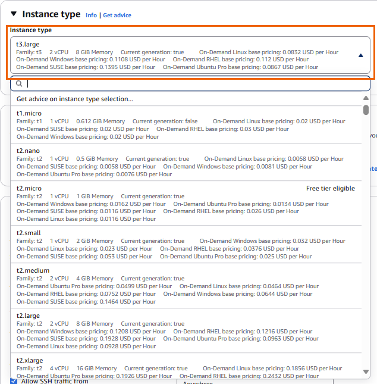{width="82%" fig-align="center"}

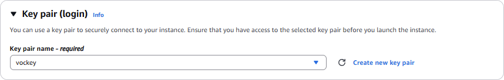{width="72%" fig-align="center"}

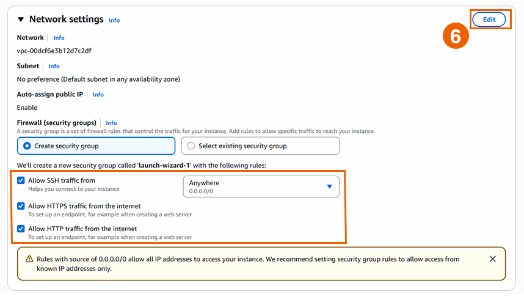{width="82%" fig-align="center"}

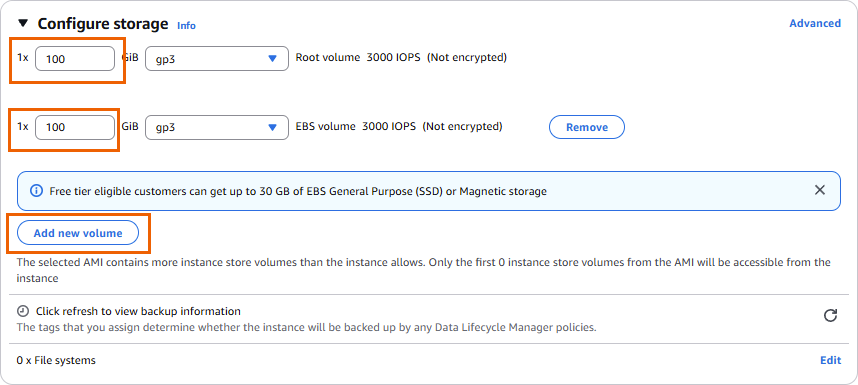{width="82%" fig-align="center"}

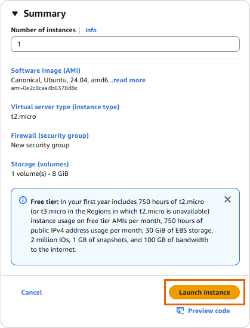{width="48%" fig-align="center"}

## SSH Key Handling

SSH keys deserve their own emphasis because mistakes here are common and risky.

Students should keep private keys:

- out of GitHub
- out of OneDrive, Google Drive, Dropbox, and other synced folders
- in a local `.ssh` folder or a course-specific secure folder
- readable only by the user account that needs the key

On macOS, Linux, or WSL:

```bash
mv ~/Downloads/labsuser.pem ~/.ssh/vockey.pem
chmod 400 ~/.ssh/vockey.pem
```

Then connect with:

```bash
ssh -i ~/.ssh/vockey.pem ubuntu@PUBLIC_DNS_OR_IP
```

On Windows PowerShell, OpenSSH can also be used, but permissions sometimes need
extra care:

```powershell
icacls vockey.pem /inheritance:r
icacls vockey.pem /grant "$env:USERNAME:R"
ssh -i .\vockey.pem ubuntu@PUBLIC_DNS_OR_IP
```

For Windows students who are comfortable with Linux commands, WSL usually gives
the smoothest SSH experience.

::: {layout-ncol=2}
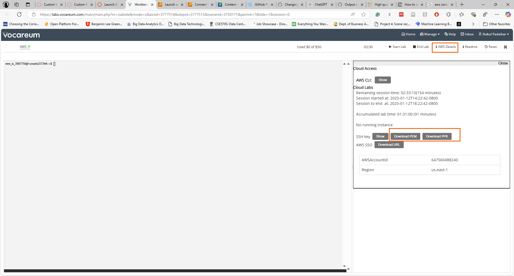

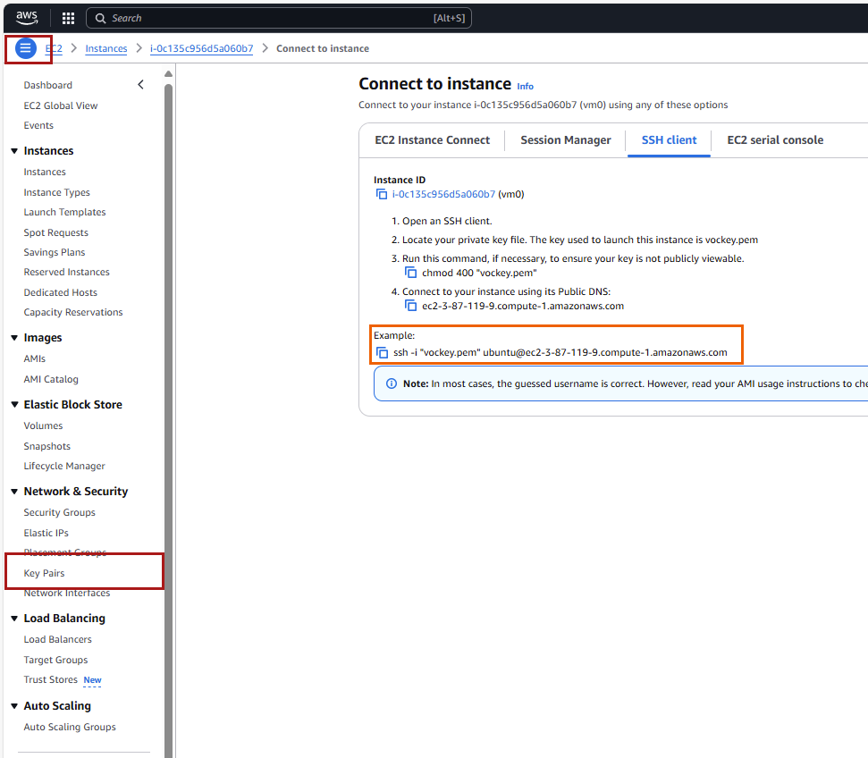
:::

## VS Code Remote-SSH

VS Code Remote-SSH gives students a familiar editor while running commands and
code on the EC2 instance.

Recommended extensions:

- Remote - SSH
- Python
- Jupyter
- Quarto
- GitHub Pull Requests or GitHub integration tools

A simple SSH config entry looks like this:

```text
Host course-ec2
  HostName PUBLIC_DNS_OR_IP
  User ubuntu
  IdentityFile ~/.ssh/vockey.pem
```

After this is saved, students can connect to `course-ec2` from the Remote
Explorer. Once connected, the terminal, file browser, Python interpreter, and
Quarto commands run on the remote machine.

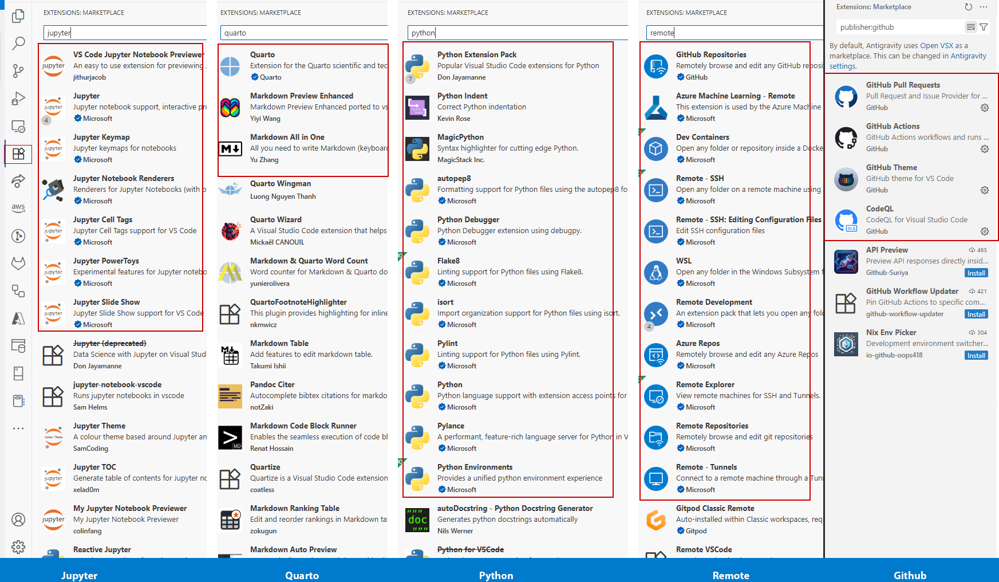{width="82%" fig-align="center"}

## Software Baseline

For an analytics course, the remote machine usually needs:

- system package updates
- Git
- Python and `pip`
- virtual environment support
- Jupyter
- Quarto
- any course-specific libraries

A minimal Ubuntu setup is:

```bash
sudo apt update
sudo apt install -y git python3 python3-pip python3-venv
python3 -m venv .venv
source .venv/bin/activate
python -m pip install --upgrade pip
python -m pip install jupyter pandas matplotlib
```

Then verify:

```bash
git --version
python --version
jupyter --version
quarto --version
```

If Quarto is not preinstalled, give students one course-approved installation
method. Avoid asking beginners to mix package managers unless there is a clear
reason.

## Working With GitHub From EC2

Students should clone their repository on the EC2 instance and push changes from
there:

```bash
git clone https://github.com/YOUR-USERNAME/YOUR-REPOSITORY.git
cd YOUR-REPOSITORY
git status
```

During work:

```bash
git status
git add .
git commit -m "Complete cloud environment setup"
git push
```

If students use SSH remotes, their GitHub SSH key must be available on the EC2
instance. For many beginner labs, HTTPS authentication or GitHub CLI
authentication is simpler to support.

## Running Jupyter Safely

When Jupyter is needed on EC2, prefer SSH port forwarding over opening broad
public access.

From the local machine:

```bash
ssh -i ~/.ssh/vockey.pem -L 8000:localhost:8888 ubuntu@PUBLIC_DNS_OR_IP
```

On the EC2 instance:

```bash
jupyter notebook --no-browser --ip=127.0.0.1 --port=8888
```

Then open the forwarded local URL in the browser. This keeps the notebook server
bound to the remote machine and accessed through the SSH tunnel.

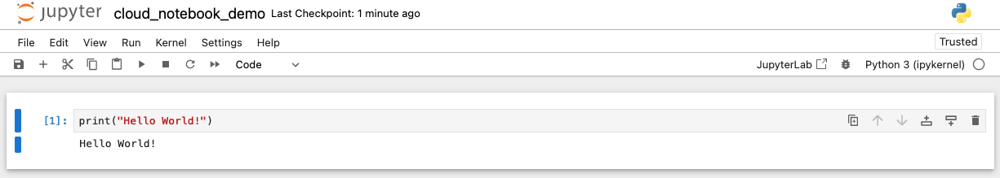{width="76%" fig-align="center"}

## Using Quarto on EC2

Quarto fits naturally into the cloud workflow because the same source file can
be edited remotely and rendered into a report, website, or slide deck.

The cloud machine should never become the only place where the work exists. It
is where students build, test, and render; GitHub is where the course source and
student submissions persist.

Inside the repository:

```bash
quarto preview
quarto render
git status
git add .
git commit -m "Render Quarto deliverable"
git push
```

If a document depends on code execution, students should render it on the same
environment where the required packages and data are available. This avoids the
classic problem where a report renders locally but fails in the cloud, or the
reverse.

For cloud-based Quarto assignments, ask students to submit evidence that connects
all three layers:

- the GitHub repository URL
- the rendered Quarto output
- a short note describing the EC2 environment used to render it

## File Transfer

Most student work should move through GitHub. For one-off files, use `scp` from
the local machine to copy a file from EC2:

```bash
scp -i ~/.ssh/vockey.pem ubuntu@PUBLIC_DNS_OR_IP:/home/ubuntu/path/to/file .
```

Students should run this from their own computer. Running `scp` from EC2 back to
a laptop usually fails because the laptop is behind a home, campus, or public
network that is not directly addressable.

## Budget and Shutdown Habits

Cloud labs add a professional responsibility: students must manage resources.

Recommended course policy:

- check the lab budget before and after each work session
- stop instances when finished
- do not create extra resources unless the assignment requires them
- push to GitHub before ending a session
- never store secrets, private keys, access tokens, or passwords in the repository

For AWS Academy environments, remind students that budget displays can lag
behind actual usage. The safe habit is to stop early, push often, and avoid
unnecessary resources.

## Cloud Lab Template

Use this structure when writing a cloud lab.

```markdown
# Lab Title

## Goal
What students will be able to do by the end.

## Required Environment
AWS Academy Learner Lab, EC2, VS Code Remote-SSH, GitHub repository.

## Setup
Start the lab, launch EC2, connect by SSH, clone the repository.

## Tasks
1. Verify the operating system and tools.
2. Install or activate the course environment.
3. Complete the analysis or build task.
4. Render the Quarto deliverable.
5. Commit and push.

## Deliverables
Repository URL, rendered HTML/PDF, command output, and reflection.

## Shutdown
Push work, stop the instance, confirm budget.
```

## Completion Checklist

- [ ] Cloud account or AWS Academy access works
- [ ] EC2 instance launches with the required settings
- [ ] SSH connection works
- [ ] VS Code Remote-SSH connection works
- [ ] GitHub repository is cloned on EC2
- [ ] Python or course runtime is verified
- [ ] Jupyter starts only through a safe access pattern
- [ ] Quarto renders successfully
- [ ] Work is committed and pushed
- [ ] Instance is stopped when work is complete

## Instructor Notes

Start with one small cloud lab before using cloud infrastructure for a major
assignment. The first lab should focus on access, SSH, GitHub, and rendering a
tiny Quarto file. Once that workflow is reliable, later labs can focus on the
analytics content instead of environment repair.

The best cloud assignment is boring at the infrastructure layer: students know
where to click, where to type, where to save, and where to submit. That lets the
course spend its energy on analysis, interpretation, and communication.
